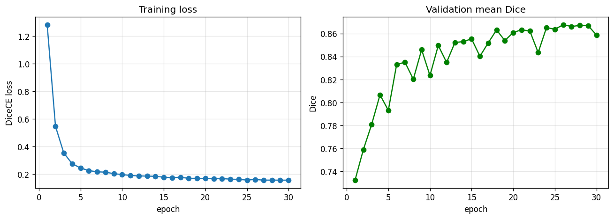
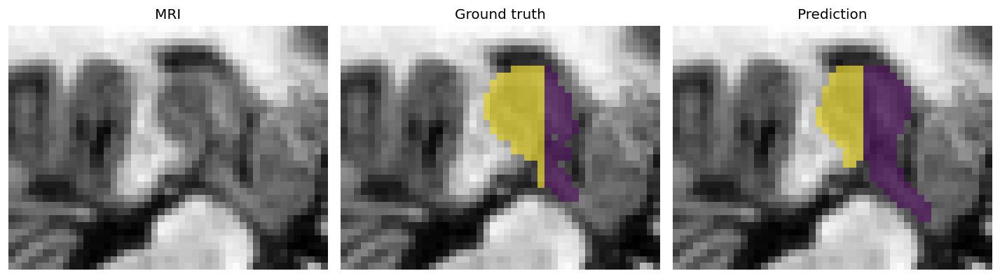

# Hippocampus MRI Segmentation with MONAI 🧠

[](https://colab.research.google.com/github/eminesu/mri-hippocampus-segmentation/blob/main/notebook.ipynb)


An end-to-end **3D medical image segmentation** pipeline that segments the **anterior and posterior hippocampus** from brain MRI, built with [MONAI](https://monai.io/) and PyTorch.

The whole project runs top-to-bottom on a free Colab GPU with **no manual setup** — the dataset is downloaded automatically. Click the badge above to try it.

## What it does

| | |
|---|---|
| **Task** | 3D semantic segmentation (3 classes: background, anterior, posterior hippocampus) |
| **Data** | Medical Segmentation Decathlon — *Task04 Hippocampus* (auto-downloaded, ~27 MB, no login) |
| **Model** | 3D U-Net (`monai.networks.nets.UNet`) |
| **Loss / metric** | Dice + cross-entropy loss · mean Dice score (foreground only) |
| **Training** | Class-balanced random patches, light augmentation, sliding-window validation |

## Pipeline

1. **Transforms** — load NIfTI volumes, reorient to RAS, resample to 1 mm³, intensity-normalize, and sample class-balanced 32³ patches with augmentation (MONAI dictionary transforms).
2. **Model** — a 3D U-Net trained with `DiceCELoss` and AdamW.
3. **Validation** — sliding-window inference over full volumes, mean Dice tracked per epoch; the best checkpoint is saved.
4. **Visualization** — training curves and ground-truth vs. predicted overlays on axial MRI slices.

## Results

Trained for 30 epochs on a free Colab GPU, the 3D U-Net reaches a **validation mean Dice of ≈ 0.87** (foreground classes: anterior + posterior hippocampus). The loss converges smoothly and the predicted segmentation closely matches the ground truth.

**Training curves**



**Prediction vs. ground truth** (axial MRI slice)



> `MAX_EPOCHS = 30` is a fast run; increasing it (100–200 epochs) pushes Dice higher still.

## Run it locally

```bash
pip install -r requirements.txt
jupyter notebook notebook.ipynb
```

A CUDA or Apple-Silicon (MPS) GPU is used automatically when available; the tiny dataset also runs on CPU.

## Why this project

Medical image segmentation — especially domain-robust segmentation from MRI — is my research focus (MSc at Heidelberg University, in collaboration with DKFZ). This repo is a compact, reproducible demonstration of the MONAI-based workflow that underpins that work.

## Next steps

- Report **per-class Dice** (anterior vs. posterior) and add k-fold cross-validation.
- Compare architectures (`SegResNet`, pretrained encoders) and add test-time augmentation.

---

*References: [MONAI](https://monai.io/) · [Medical Segmentation Decathlon](http://medicaldecathlon.com/). Built by [Emine Şevval Eş Uzunay](https://www.linkedin.com/in/eminesevvalesuzunay).*
